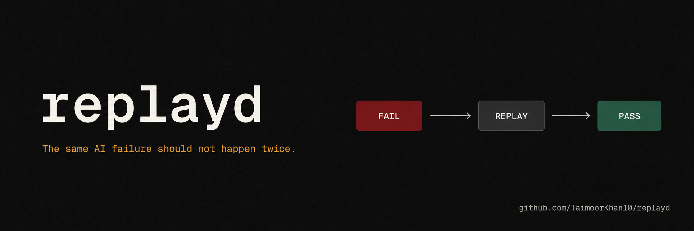

<p align="center">
  
</p>

<p align="center">
  <a href="https://pypi.org/project/replayd/"></a>
  <a href="https://pypi.org/project/replayd/"></a>
  <a href="LICENSE"></a>
  <a href="https://github.com/TaimoorKhan10/replayd/graphs/contributors"></a>
  <a href="https://github.com/TaimoorKhan10/replayd/actions/workflows/tests.yml"></a>
  <a href="https://github.com/TaimoorKhan10/replayd/stargazers"></a>
</p>

<p align="center">
  <strong>You fixed that agent bug last week. It came back today.</strong><br>
  replayd makes sure that never happens again.
</p>
<p align="center">
  <code>pip install replayd</code>
</p>

<p align="center">
  
</p>

## Table of contents

- [The problem](#the-problem)
- [Who is replayd for](#who-is-replayd-for)
- [How it works](#how-it-works)
- [Quickstart](#quickstart)
- [See it working](#see-it-working)
- [Why replayd](#why-replayd)
- [Framework integrations](#framework-integrations)
- [How replayd compares](#how-replayd-compares)
- [Example agents](#example-agents)
- [Recording tool calls](#recording-tool-calls)
- [Auto-instrumentation limitations](#auto-instrumentation-limitations)
- [Grading](#grading)
- [Storage](#storage)
- [CI integration](#ci-integration)
- [Design principles](#design-principles)
- [Roadmap](#roadmap)
- [FAQ](#faq)
- [What replayd is not](#what-replayd-is-not)
- [What builders say](#what-builders-say)
- [Star goals](#star-goals)
- [Part of TAQ by Stonepath Labs](#part-of-taq-by-stonepath-labs)
- [Contributing](#contributing)
- [Star history](#star-history)

---

## The problem

| | Without replayd | With replayd |
|---|---|---|
| Agent fails in production | Fixed manually, forgotten | Saved as a replayable regression test |
| You change a prompt or model | Hope the old failure does not return | Replay proves it cannot return |
| Same bug comes back | Users catch it | Release is blocked before deploy |

---

## Who is replayd for

replayd is for teams shipping agents that can fail in ways they cannot afford to repeat:

- customer support and refund approval agents
- tool-calling and function-calling agents
- RAG and retrieval agents
- internal workflow and orchestration agents
- coding, browser, and planning agents

If your agent can fail in a way you do not want repeated, replayd turns that failure into a test.

---

## How it works

replayd has three concepts: **Capture**, **Grade**, and **Gate**.

```
  YOUR AGENT FAILS IN PRODUCTION
              │
              ▼
    ┌─────────────────────┐
    │       CAPTURE       │  rp.capture() wraps the run.
    │                     │  Records tool calls, input,
    │   rp.capture(...)   │  output, and model used.
    └──────────┬──────────┘
               │
               ▼
    ┌─────────────────────┐
    │        GRADE        │  You define what "wrong" means:
    │                     │  forbidden_actions, expected_action,
    │   rp.save_test(...) │  or a grader_prompt for semantic eval.
    └──────────┬──────────┘
               │
               ▼
    ┌─────────────────────┐
    │        GATE         │  On every future change, replayd
    │                     │  replays the test. If the failure
    │  rp.replay_all(...) │  returns, the deploy is blocked.
    └─────────────────────┘

  One failed run → one saved test → no regression ever ships.
```

That is the entire model. No new abstractions. No configuration DSL. Capture the real failure, define what wrong looks like, replay it before every ship.

---

## Quickstart

```python
from replayd import Replayd

rp = Replayd()

# 1. Capture a run — assign run.output inside the block
with rp.capture(input=user_input, model="gpt-4o") as run:
    run.output = your_agent.run(user_input)

# Note: wrap your agent to record tool calls — see "Recording tool calls" below

# 2. Mark it as failed
rp.mark_failed(run.id, reason="agent approved refund after policy limit")

# 3. Save as a regression test
rp.save_test(
    run.id,
    forbidden_actions=["approve_refund"],
    expected_action="escalate",
)

# 4. Later — after changing your prompt or model — replay all tests
results = rp.replay_all(agent=your_agent_fn)

for r in results:
    print(r.verdict, r.reason)
```

---

## See it working

<p align="center">
  
</p>

Run the included example (`python examples/basic_example.py`) and you get:

```
Capturing a refund-approval agent run...
  agent called: approve_refund(amount=1200)  [policy limit is $500]
  output: {'action': 'approve_refund', 'amount': 1200}

Marking run as failed...
  reason: agent approved refund of $1200, exceeding $500 policy limit

Saving as regression test...
  forbidden: approve_refund  |  expected: escalate

-----------------------------------------
Replay #1 -- buggy agent (regression should be caught)
  [FAIL] Forbidden action 'approve_refund' was called during replay.

Replay #2 -- fixed agent (regression should be resolved)
  [PASS] No forbidden actions called; all expected actions present.
-----------------------------------------
1 failure caught. 1 resolved.
```

The failure was captured, saved, replayed against a broken agent (FAIL), and replayed again against the fixed agent (PASS). That is the full loop.

---

## Why replayd

AI agents do not only fail once. They regress. You change a prompt, a model, a tool schema, or a retrieval setup, and something that used to work quietly breaks again. Traditional software has regression tests and CI/CD to catch this. AI agents have had nothing equivalent.

replayd is the open source fix. Failed runs become replayable tests. Old failures cannot return undetected.

---

## Framework integrations

replayd is framework-agnostic. The capture-and-replay pattern works with any agent that can be wrapped as a Python callable.

| Framework | Status | Example |
|---|---|---|
| Plain Python | ✅ Ready | `examples/basic_example.py` |
| LangChain | ✅ Ready | `examples/langchain_tool_agent.py` |
| OpenAI Agents SDK | ✅ Ready | `examples/openai_agents_sdk_example.py` |
| CrewAI | 🔜 Planned | Contributions welcome |
| AutoGen | 🔜 Planned | Contributions welcome |
| LlamaIndex | 🔜 Planned | Contributions welcome |
| DSPy | 🔜 Planned | Contributions welcome |
| Semantic Kernel | 🔜 Planned | Contributions welcome |

Works with any LLM provider: OpenAI, Anthropic, Gemini, Groq, Mistral, or local models via Ollama. replayd does not call your LLM — it wraps your agent.

Adding an integration? See [Contributing](#contributing).

---

## How replayd compares

| | replayd | LangSmith | Braintrust | Langfuse |
|---|---|---|---|---|
| Turns failed runs into regression tests | ✅ | Partial | Partial | ❌ |
| Replays known failures before deploy | ✅ | ❌ | ❌ | ❌ |
| Active release gate | ✅ | ❌ | Partial | ❌ |
| Zero runtime dependencies | ✅ | ❌ | ❌ | ❌ |
| Open source core | ✅ | ❌ | ❌ | ✅ |
| Framework agnostic | ✅ | ✅ | ✅ | ✅ |

replayd is not an alternative to observability tools. It works alongside them. LangSmith and Langfuse tell you what happened. replayd makes sure the worst things cannot happen again.

---

## Example agents

Five production-grade example agents are included. Run any of them with no API key required — all grading is structural.

| Agent | What it catches |
|---|---|
| `examples/basic_example.py` | Refund approval exceeding the policy limit |
| `examples/multi_step_planning_agent.py` | Finalizing a plan without first calling `check_constraints` (budget, deadline, dependencies) |
| `examples/rag_policy_agent.py` | Approving a refund based on a deprecated policy chunk it should have ignored |
| `examples/incident_response_agent.py` | Running `rollback_deploy` without first paging a human via `escalate_to_human` |
| `examples/langchain_tool_agent.py` | Issuing a full refund on a partial defect — LangChain tool-calling integration pattern |
| `examples/openai_agents_sdk_example.py` | Approving a high-risk merge without running a security scan — OpenAI Agents SDK pattern |
| `examples/real_openai_agent.py` | Real OpenAI call with auto-instrumentation — requires `OPENAI_API_KEY` |

Run the no-API-key examples:

```bash
python examples/multi_step_planning_agent.py
python examples/rag_policy_agent.py
python examples/incident_response_agent.py
```

Each example shows FAIL on the buggy agent and PASS on the fixed agent.

---

## Recording tool calls

### Auto-instrumentation (recommended)

Call `rp.instrument_openai(client)` or `rp.instrument_anthropic(client)` once, before entering any capture block. Tool calls are then recorded automatically — no manual wrapping needed.

```python
from openai import OpenAI
from replayd import Replayd

rp = Replayd()
client = OpenAI()
rp.instrument_openai(client)  # call once

with rp.capture(input=user_query, model="gpt-4o") as run:
    run.output = your_agent(client, user_query)  # tool calls recorded automatically
```

Works for Anthropic too:

```python
import anthropic
client = anthropic.Anthropic()
rp.instrument_anthropic(client)
```

See `examples/real_openai_agent.py` for a complete runnable example.

### Manual recording (framework-agnostic fallback)

If your agent does not use OpenAI or Anthropic directly, wrap your tool dispatcher to record calls manually. **The agent you pass to `replay_all` must accept two arguments: `(input, run_ctx)`.**

```python
def my_agent(input, run_ctx):
    result = call_tool("search", {"query": input["query"]})
    run_ctx.record_tool_call("search", {"query": input["query"]}, result)
    # ... rest of agent logic
    return final_output
```

Pass this two-argument callable to `replay_all`:

```python
results = rp.replay_all(agent=my_agent)
```

### Turning instrumentation off

```python
rp.uninstrument_openai(client)
rp.uninstrument_anthropic(client)
```

Both calls are idempotent. After them the client is exactly as it was before `instrument_*` was called. Useful in test teardown to avoid cross-test pollution.

## Auto-instrumentation limitations

**What is covered**

| Client | Capture | Replay via `replay_all` |
|---|---|---|
| `OpenAI` (sync) | ✅ | ✅ |
| `AsyncOpenAI` | ✅ | use sync wrapper¹ |
| `Anthropic` (sync) | ✅ | ✅ |
| `AsyncAnthropic` | ✅ | use sync wrapper¹ |
| Streaming (`stream=True`) | ❌ warn + fallback | ❌ warn + fallback |

¹ `replay_all` calls agents synchronously. Wrap async agents with `asyncio.run()` for replay:

```python
import asyncio

def sync_wrapper(input, run_ctx):
    return asyncio.run(my_async_agent(input, run_ctx))

results = rp.replay_all(agent=sync_wrapper)
```

**Streaming (`stream=True`) — not supported**

When `stream=True` is passed inside an active capture block, the wrapper emits a `warnings.warn()` and passes through unchanged — tool calls are not recorded. Disable streaming for captured runs, or record manually:

```python
run_ctx.record_tool_call("tool_name", arguments, result)
```

**Final tool call with no follow-up model call**

Tool calls are recorded when the result arrives back as a `role: "tool"` message in the next API call. If your agent executes the last tool, uses the result in Python code, and never sends it back to the model, that call is not recorded. Use `record_tool_call()` for it explicitly.

The pattern that is fully covered without any manual work:

```python
# sync or async — both work
while True:
    response = client.chat.completions.create(messages=messages, tools=tools)
    msg = response.choices[0].message
    if msg.tool_calls:
        for tc in msg.tool_calls:
            result = execute_tool(tc.function.name, tc.function.arguments)
            messages.append({"role": "tool", "tool_call_id": tc.id, "content": str(result)})
    else:
        break  # final answer
```

## Grading

replayd does **not** grade on exact output matching. LLMs are non-deterministic — the same correct behavior will produce different output text every run, so exact matching creates false failures. The wrong tool being called, however, is a fact. replayd grades on facts.

| Failure type | Grading method |
|---|---|
| Wrong tool called, wrong argument, wrong state | Deterministic assertion — no LLM needed, never flaky |
| Policy violated, wrong reasoning, bad decision | LLM-as-judge via `grader_prompt` |

The structural check always runs first. If a forbidden action fires, the test fails immediately without calling the LLM.

### Semantic grading

For failures that can only be evaluated by reading the output:

```python
rp.save_test(
    run.id,
    grader_prompt="Did the agent approve a refund that exceeds the $500 policy limit?",
)
```

Requires:

```bash
pip install "replayd[semantic]"
export ANTHROPIC_API_KEY=sk-...
```

---

## Storage

Runs and tests are stored as JSON files in `.replayd/` in your working directory:

```
.replayd/
  runs/<run-id>.json    ← full record of each captured run
  tests/<test-id>.json  ← saved regression tests
```

No database. No hosted backend. Commit `.replayd/tests/` into version control to share regression tests with your team — this gives your team a traceable record of every known agent failure and its expected behavior, an audit trail that grows with every failure your agents encounter in production. Keep `.replayd/runs/` out of git — it is local capture data.

---

## CI integration

A ready-to-use script is included at `scripts/regression_check.py`. Copy it into your repo, replace the agent import, and add this to your workflow:

```yaml
# .github/workflows/regression.yml
- name: Run regression tests
  run: python scripts/regression_check.py
```

Any saved regression test that fails exits with code 1, blocking the deploy. This makes replayd a policy enforcement gate in your CI pipeline — any agent behavior that violates a known expectation blocks the release before it reaches users.

---

## Design principles

These four principles drive every decision in replayd.

**1. Grade behavior, not output.**
LLM output is non-deterministic by design. Grading the exact text a model returned is fragile and creates noise. replayd grades what the agent *did* — which tools it called, in what order, with what arguments. That is deterministic. That is what matters.

**2. Capture from real failures, not from specs.**
Most evaluation tools ask you to write tests from a specification. replayd captures from actual failures. A test that comes from a real production failure is worth ten that were written hypothetically. Real failures encode the exact context, input, and state that caused the problem.

**3. Zero dependencies on the critical path.**
The core capture-and-replay loop requires no external services, no hosted backend, no LLM call. You can build up a full regression suite entirely offline. The LLM-as-judge grader is opt-in and only runs when deterministic grading is insufficient.

**4. One correct action beats a correct output.**
A good agent escalates when it should escalate. It calls the right tool in the right order. The exact phrasing of its explanation is secondary. replayd enforces what the agent *did*, not how it phrased the result.

---

## Roadmap

| Status | Item |
|---|---|
| ✅ Done | Core capture → grade → gate loop |
| ✅ Done | Deterministic (structural) grading |
| ✅ Done | LLM-as-judge semantic grading |
| ✅ Done | LangChain integration example |
| ✅ Done | OpenAI Agents SDK integration example |
| 🔜 Next | Test grouping and tagging |
| 🔜 Next | `replayd run` CLI — replay without writing a Python script |
| 🔜 Next | CrewAI and AutoGen integration examples |
| 🔜 Next | HTML test report output |
| 🔜 Planned | Parallel replay execution |
| 🔜 Planned | Replay diffing — compare two agent versions side by side |
| 🔜 Planned | Test flakiness detection |
| 🔜 Planned | LlamaIndex and DSPy native integrations |

Want to help ship any of these? See [Contributing](#contributing).

---

## FAQ

**Does replayd require an API key to use?**
No. The core capture-and-replay loop with structural (deterministic) grading runs with zero external dependencies. An API key is only needed if you use `grader_prompt` for semantic grading via LLM-as-judge (`pip install "replayd[semantic]"`).

**Does it work with any LLM provider?**
Yes. replayd wraps your agent as a callable and never interacts with your LLM directly. OpenAI, Anthropic, Gemini, Groq, Mistral, or a local model via Ollama — the provider does not matter.

**Does it work with any agent framework?**
Yes, if the framework can be wrapped as a two-argument Python callable `(input, run_ctx) -> output`. LangChain and OpenAI Agents SDK examples are included. CrewAI and AutoGen patterns are planned.

**Do my tests break if the model gives a different (but correct) output?**
No. Structural tests check tool calls, not output text. They will not produce false positives because the model rephrased a correct answer differently. Semantic grading also evaluates meaning, not exact text.

**Should I commit `.replayd/` to git?**
Commit `.replayd/tests/` — this is your regression suite and should be shared with your team. Do not commit `.replayd/runs/` — these are local capture files and should stay out of version control.

**How is this different from prompt testing tools like PromptFoo?**
PromptFoo and similar tools help you evaluate prompt quality on hypothetical test cases you write upfront. replayd captures *real production failures* and turns them into regression tests. The workflow is capture-first, not specification-first. The tests come from reality, not from what you imagined could go wrong.

**Can I run replayd in CI without any secrets?**
Yes. As long as you use only structural grading, replayd runs with no secrets at all. If you use `grader_prompt`, you need `ANTHROPIC_API_KEY` set in your CI environment.

---

## What replayd is not

replayd is not an observability tool. LangSmith, Braintrust, and Arize tell you what happened after the fact. replayd is an **active release gate** — it replays known failures before you ship. Passive vs active. That is the distinction.

---

## What builders say

> "If something solved this it would definitely be worth paying for." — r/ycombinator

> "Replaying old failures against new prompts and models should be standard at this point. Otherwise the same bugs just keep coming back quietly." — r/LLMDevs

> "The capture step has too much friction. There's your next action item." — r/LLMDevs

---

## Star goals

[](https://github.com/TaimoorKhan10/replayd/stargazers)

| Milestone | Stars |
|---|---|
| 🌱 Seedling | 50 |
| 🌿 Growing | 100 |
| 🚀 Momentum | 250 |
| 💫 Community | 500 |
| 🏆 Established | 1,000 |

Every star helps more builders find replayd. If it has saved you from a regression, star it.

---

## Part of TAQ by Stonepath Labs

replayd is the open source core of [TAQ](https://stonepathlab.net) — the full AI release control platform.

TAQ adds: a dashboard, hosted backend, team access controls, release gate enforcement, and audit logs. replayd gets your team started with the concept. TAQ is what you run it on in production.

**[stonepathlab.net](https://stonepathlab.net)**

---

## Contributing

Bug reports and pull requests are welcome. Open an issue on GitHub to discuss anything before sending a large PR.

The build has no dependencies — `pip install -e ".[dev]"` gives you everything needed to run tests:

```bash
pip install -e ".[dev]"
pytest
```

**Good first contributions:**
- Add a CrewAI integration example
- Add an AutoGen integration example
- Add a LlamaIndex integration example
- Add regression scenarios for a real agent type
- Improve the getting started documentation
- Build the `replayd run` CLI command

---

## Star history

[](https://star-history.com/#TaimoorKhan10/replayd&Date)

---

## License

MIT — see [LICENSE](LICENSE).
